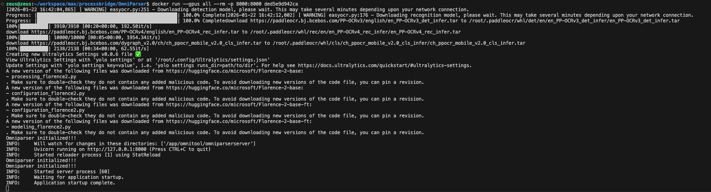

# ProcessBridge Service

A Docker-based image processing service that provides API endpoints for image analysis.

## Getting Started

### Prerequisites
- Docker and Docker Compose installed
- (Optional) NVIDIA GPU with Docker GPU support for CUDA acceleration

See:


### Running the Service

1. **Build and start the service:**
   ```bash
   docker compose up --build
   ```

2. **The service will be available at:**
   ```
   http://localhost:8000
   ```

## Testing the Service

### Preparing Test Images

The repository includes sample images in the `imgs/` directory for testing.

### Encoding Images for API Requests

Convert your image to base64 format:

```bash
cat demo_image.jpg | base64 | tr -d '\n' | pbcopy
```

This will copy the base64-encoded string to your clipboard.

### Making API Requests

Navigate to `http://localhost:8000/` in your browser and paste the base64-encoded string into the appropriate route endpoint.

## GPU Support (Optional)

To enable CUDA support for GPU acceleration, uncomment the following section in `docker-compose.yaml`:

```yaml
deploy:
  resources:
    reservations:
      devices:
        - driver: nvidia
          count: all
          capabilities: [gpu]
```

**Note:** Requires NVIDIA GPU and nvidia-docker runtime installed on your host system.